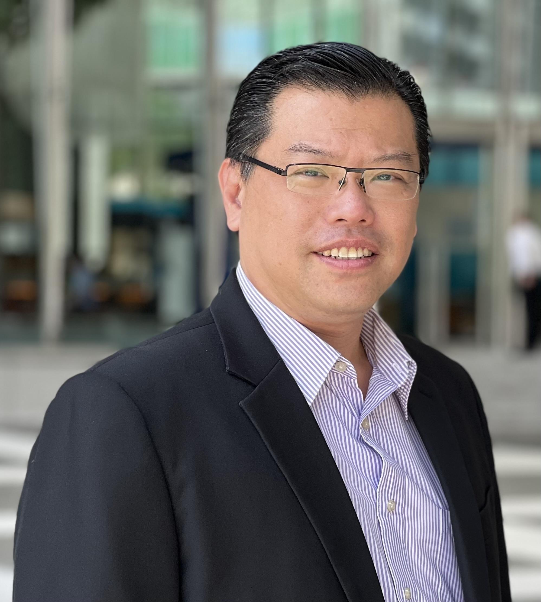
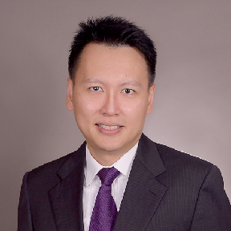
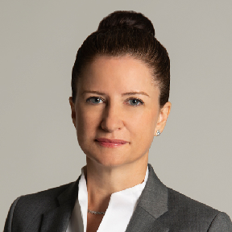
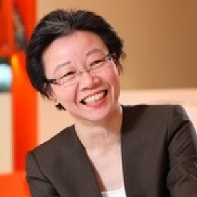
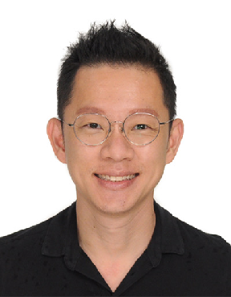
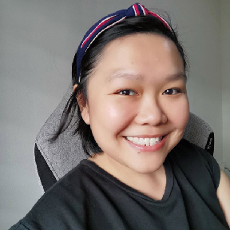
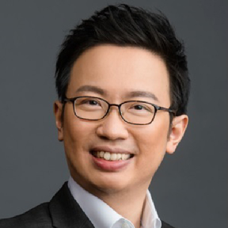

## Who we are

MBSAAS connects alumni of Alliance Manchester Business School living and working in Singapore. We organise networking events, support current students, and take part in the annual Manchester Day of Action.

This page is a POC sample: it lives in the LIVE drive under Pages.

## **About AMBSAAS**

Established in November 2003, The Alliance Manchester Business School Alumni Association of Singapore (AMBSAAS) is one of only 2 alumni associations in the world formed specifically for MBS alumnus. All subsequent alumni associations formed after us in their respective localities are UOM alumni associations.

Come 2023, AMBSAAS will be celebrating its 20th anniversary. Looking back over the years, we have had the good fortune of having many alumni who came forward to volunteer their time on the Council to organise academic and technical evening talks, social gatherings, fundraisers, the annual Manchester Day of Action and many other networking events. Many of you also came back to support the Centre in their marketing efforts by speaking to prospective and new students, imparting on them the knowledge, experiences and camaraderie that you yourself have benefitted from, during your MBA journey.

As our AMBS alumni progresses in their careers, they continue to bring good repute to AMBS in the business and wider community by carrying themselves professionally and competently amongst their colleagues and peers. AMBSAAS is very proud of each and every one of our alumni.

20 years on, AMBSAAS has achieved the objectives set out in its constitution and will continue doing so in the years to come:

* *Create networking opportunities with and between alumni*
* *Supporting the marketing efforts of AMBS*
* *Improving the status of AMBS through members’ influences in the business and wider community*

The value of our MBA is not just the knowledge and insights gained but also, the camaraderie formed during our studies and across batches of alumni that went before us, and those to come. We warmly welcome you to actively participate in AMBSAAS activities whenever you can and tap into the Manchester Network.A

#### **Founding President**

Wayne Soo

Wayne Soo is the Founding President of The Alliance Manchester Business School Alumni Association of Singapore (AMBSAAS) in 2003\. After serving 3 terms as Honorary President, Wayne has been the Emeritus President of AMBSAAS since 2020\.

Professionally, Wayne has more than 25 years of auditing, financial and management consultancy experience initially with **Ernst & Young** (both in Malaysia and Singapore) before establishing his own firm in 2004, **Fiducia LLP**.

According to the Singapore Business Review, the firm is the 23rd largest accounting firm in Singapore as at December 2019 with over 60 professionals. In January 2020, Fiducia LLP became a full member of **Integra International**, a top 15 network of professional firms.

In his free time, Wayne provides mentorship to start-ups and students of the AMBS MBA programme.

### **Meet the Council Members**

\
[**Teo Teck Loon**](https://mbsaas.org/team/teo-teck-loon/)\
Honorary President

\
[**Nicole Tretwer**](https://mbsaas.org/team/nicole-tretwer/)\
Honorary Treasurer\
\
[**Lesley Ngai**](https://mbsaas.org/team/lesley-ngai/)\
Honorary Member

\
[**Lester Teo**](https://mbsaas.org/team/lester-teo/)\
Honorary Member

\
[**Andrea Teo**](https://mbsaas.org/team/andrea-teo/)\
Honorary Member

\
[**Desmond Heng**](https://mbsaas.org/team/desmond-heng/)\
Honorary Secretary
