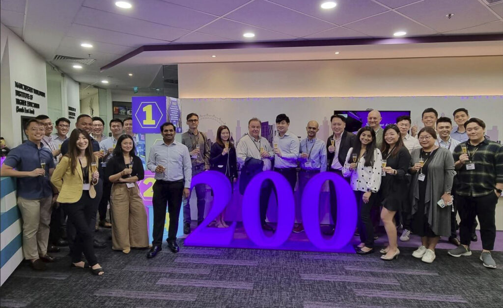
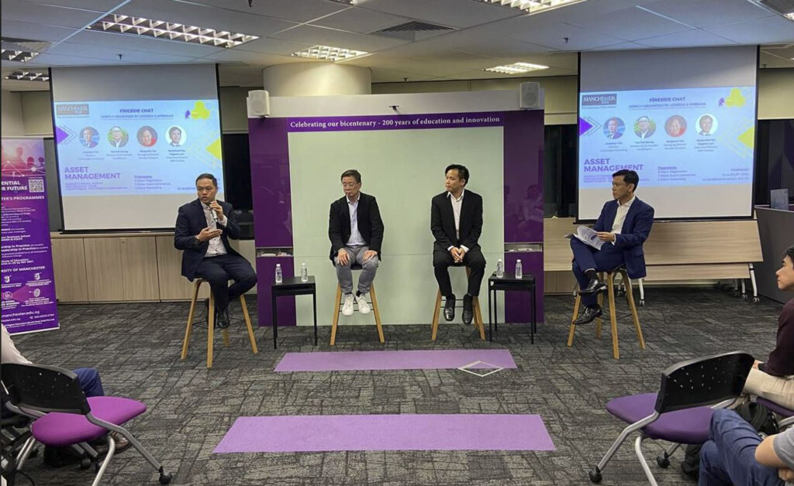
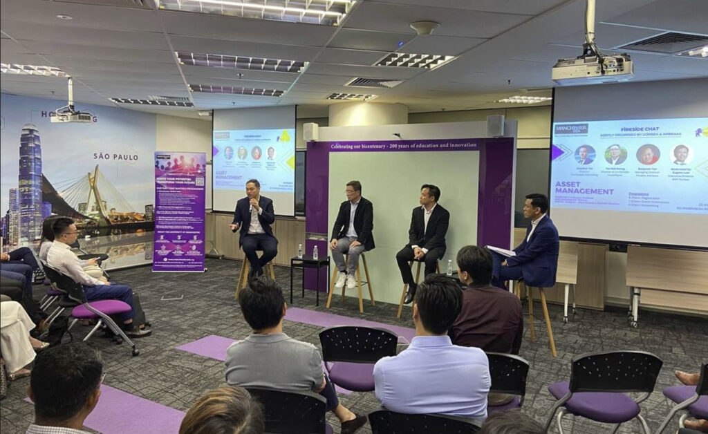

## Signature Fireside Chat on Asset Management

This year’s AMBSAAS Fireside Chat brought together thought leaders in the field of Asset Management for a lively and insightful discussion. We were honored to have Benjamin Toh, Kok Keong Tan, and Jonathan Tan – 陈耀宗 as our distinguished panelists, who shared their deep expertise, leaving the AMBSAAS community with invaluable takeaways.

Our heartfelt thanks to Manchester Worldwide (S.E. Asia) for your unwavering support of the alumni community. Your dedication is deeply appreciated by both the Council and members.

For alumni and current students who have not yet connected, we encourage you to join the growing network.

[**See more.**](https://www.linkedin.com/feed/update/urn:li:activity:7234835896867373056)

### Join Our Community\!

[Join Us Now](https://www.linkedin.com/company/mbsaas/?viewAsMember=true)
