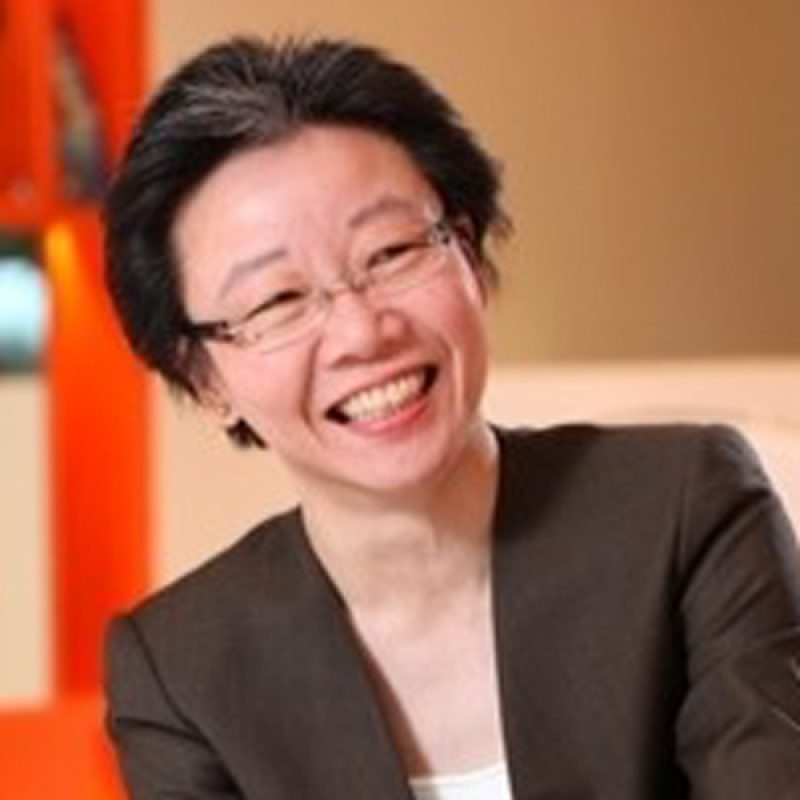

#### Honorary Member

Lesley is the Council Member who oversees our STE@M (Start-ups, Tech and Entrepreneurship @ Manchester) initiatives. This Special Interest Group aims to create an entrepreneurial ecosystem within the MBSAAS community through strategic partnerships, networking events, and entrepreneurial development programs. On 20th February 2020, MBSAAS signed an MOU with the Action Community for Entrepreneurship (ACE) with the goal to promote a vibrant start-up ecosystem for MBSAAS community and to serve the start-ups networks in ACE.

As a professional, Lesley has 30 years of leading large scale business transformation programs for revenue generation and cost savings. She founded leading parenting website SmartParents.sg, food app 8DAYS EAT and growth hacked several other websites before leaving the corporate life and founded her own boutique digital agency, [Bit by Bit Marketing](https://bitbybitmarket.com/). Lesley is in the midst of developing a [data analytics platform](https://abovethesun.app/) with the focus to provide mental health experts real-world data.

Lesley is an avid learner in the digital and technology space with particular interest in health. She is a regular mentor with ACE.
