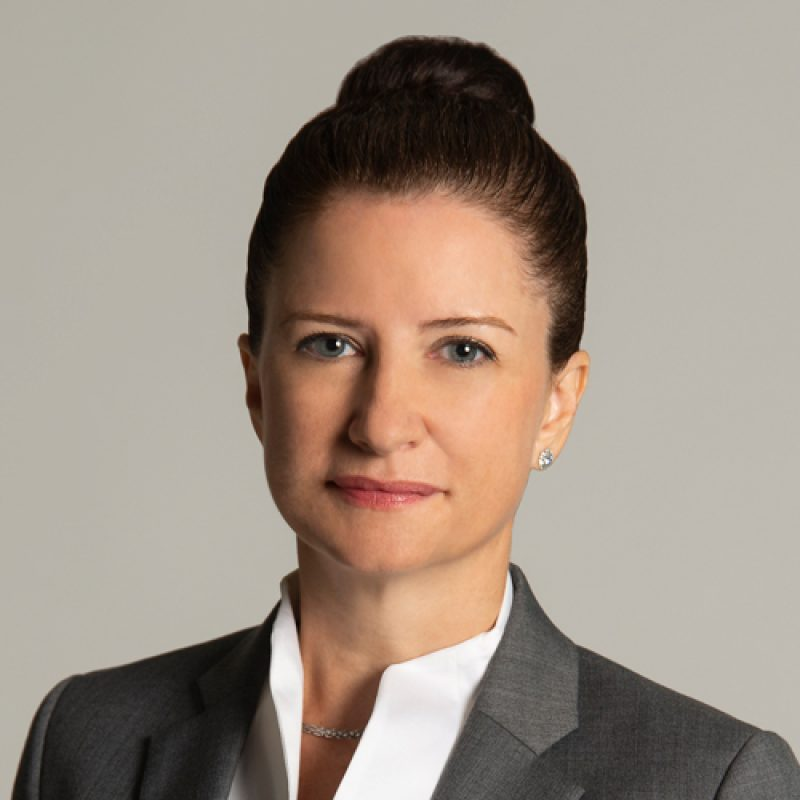

#### Honorary Treasurer

The Honorary Secretary is part of the Office Bearers of MBSAAS. The Honorary Secretary is responsible for all matters relating to membership as well as record keeping, excluding financial. This also mean organising the council meeting and annual general meeting and ensuring records are kept. The Honorary Secretary also performs representative duties as and when required.

Nicole is now on her second term as Hon Secretray of MBSAAS. She has more than 20 years of professional experiences in supply chain, logistics, sales and operations. She is currently the regional 4PL sales leader of Kuehne+Nagel, with a passion to digitise and make supply chains resilient. Nicole has spent the past 15 years on different postings across Asia-Pacific and grew up in Costa Rica.

In her spare time, Nicole enjoys playing tennis and riding her bicycle across Singapore.
